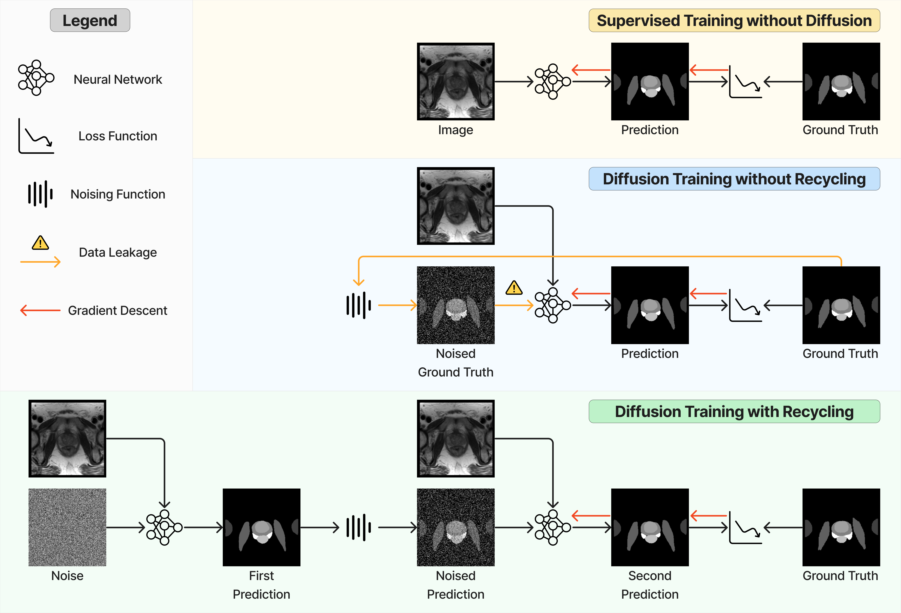

# ImgX-DiffSeg

ImgX-DiffSeg is a Jax-based deep learning toolkit using Flax for biomedical image segmentation.

This repository includes the implementation of the following work

- [A Recycling Training Strategy for Medical Image Segmentation with Diffusion Denoising Models](https://melba-journal.org/2023:016)
- [Importance of Aligning Training Strategy with Evaluation for Diffusion Models in 3D Multiclass Segmentation](https://arxiv.org/abs/2303.06040)

:construction: **The codebase is still under active development for more enhancements and
applications.** :construction:

- November 2023:
  - :warning: Upgraded to JAX to 0.4.20.
  - :warning: Removed Haiku-specific modification to convolutional layers. This may impact model
    performance.
  - :smiley: Added example notebooks for inference on a single image without TFDS.
  - Added integration tests for training, validation, and testing.
  - Refactored config.
    - Added `patch_size` and `scale_factor` to data config.
    - Moved loss config from the main config to task config.
  - Refactored code, including defining `imgx/task` submodule.
- October 2023:
  - :blush: Migrated from [Haiku](https://github.com/google-deepmind/dm-haiku) to
    [Flax](https://github.com/google/flax) following Google DeepMind's recommendation.

:mailbox: Please feel free to
[create an issue](https://github.com/mathpluscode/ImgX-DiffSeg/issues/new/choose) to request
features or [reach out](https://orcid.org/0000-0002-1184-7421) for collaborations. :mailbox:

<div>
</img>
</div>

## Features

Current supported functionalities are summarized as follows.

**Data sets**

See the [readme](imgx_datasets/README.md) for further details.

- Muscle ultrasound from [Marzola et al. 2021](https://data.mendeley.com/datasets/3jykz7wz8d/1).
- Male pelvic MR from [Li et al. 2022](https://zenodo.org/record/7013610#.Y1U95-zMKrM).
- AMOS CT from [Ji et al. 2022](https://zenodo.org/record/7155725#.ZAN4BuzP2rO).
- Brain MR from [Baid et al. 2021](https://arxiv.org/abs/2107.02314).

**Algorithms**

- Supervised segmentation.
- Diffusion-based segmentation.
  - [Gaussian noise based diffusion](https://arxiv.org/abs/2211.00611).
  - Noise prediction ([epsilon-parameterization](https://arxiv.org/abs/2006.11239)) or ground truth
    prediction ([x0-parameterization](https://arxiv.org/abs/2102.09672)).
  - [Importance sampling](https://arxiv.org/abs/2102.09672) for timestep.
  - Recycling training strategies, including [xt-recycling](https://arxiv.org/abs/2303.06040) and
    [xT-recycling](https://melba-journal.org/2023:016).
  - Self-conditioning training strategies, including
    [Chen et al. 2022](https://arxiv.org/abs/2208.04202) and
    [Watson et al. 2023.](https://www.nature.com/articles/s41586-023-06415-8).

**Models**

- [U-Net](https://arxiv.org/abs/1505.04597) with [Transformers](https://arxiv.org/abs/1706.03762)
  supporting 2D and 3D images.
- [Efficient attention](https://arxiv.org/abs/2112.05682).

**Training**

- Patch-based training.
- Multi-device training (one model per device) with
  [`pmap`](https://jax.readthedocs.io/en/latest/_autosummary/jax.pmap.html).
- Mixed precision training.
- Gradient clipping and accumulation.
- [Early stopping](https://flax.readthedocs.io/en/latest/api_reference/flax.training.html).

## Installation

### TPU with Docker

The following instructions have been tested only for TPU-v3-8. The docker container uses the root
user.

1. TPU often has limited disk space.
   [RAM disk](https://www.linuxbabe.com/command-line/create-ramdisk-linux) can be used to help.

   ```bash
   sudo mkdir /tmp/ramdisk
   sudo chmod 777 /tmp/ramdisk
   sudo mount -t tmpfs -o size=256G imgxramdisk /tmp/ramdisk
   cd /tmp/ramdisk/
   ```

2. Build the docker image inside the repository.

   ```bash
   sudo docker build --build-arg USER_ID=$(id -u) --build-arg GROUP_ID=$(id -g) -f docker/Dockerfile.tpu -t imgx .
   ```

   where

   - `--build-arg` provides argument values.
   - `-f` provides the docker file.
   - `-t` tag the docker image.

3. Run the Docker container.

   ```bash
   mkdir -p $(cd ../ && pwd)/tensorflow_datasets
   sudo docker run -it --rm --privileged --network host \
   -v "$(pwd)":/app/ImgX \
   -v "$(cd ../ && pwd)"/tensorflow_datasets:/root/tensorflow_datasets \
   imgx bash
   ```

4. Install the package inside the container.

   ```bash
   make pip
   ```

### GPU with Docker

CUDA >= 11.8 is required. The docker container uses non-root user.
[Docker image used may be removed.](https://gitlab.com/nvidia/container-images/cuda/blob/master/doc/support-policy.md)

1. Build the docker image inside the repository.

   ```bash
   docker build --build-arg HOST_UID=$(id -u) --build-arg HOST_GID=$(id -g) -f docker/Dockerfile -t imgx .
   ```

   where

   - `--build-arg` provides argument values.
   - `-f` provides the docker file.
   - `-t` tag the docker image.

2. Run the Docker container.

   ```bash
   mkdir -p $(cd ../ && pwd)/tensorflow_datasets
   docker run -it --rm --gpus all \
   -v "$(pwd)":/app/ImgX \
   -v "$(cd ../ && pwd)"/tensorflow_datasets:/home/app/tensorflow_datasets \
   imgx bash
   ```

   where

   - `--rm` removes the container once exits it.
   - `-v` maps the current folder into the container.

3. Install the package inside the container.

   ```bash
   make pip
   ```

### Local with Conda

#### Install Conda for Mac M1

[Download Miniforge](https://github.com/conda-forge/miniforge/releases/latest/download/Miniforge3-MacOSX-arm64.sh)
from [GitHub](https://github.com/conda-forge/miniforge) and install it.

```bash
conda install -y -n base conda-libmamba-solver
conda config --set solver libmamba
conda env update -f docker/environment_mac_m1.yml
```

#### Install Conda for Linux / Mac Intel

[Install Conda](https://docs.conda.io/projects/conda/en/latest/user-guide/install/index.html) and
then create the environment.

```bash
conda install -y -n base conda-libmamba-solver
conda config --set solver libmamba
conda env update -f docker/environment.yml
```

#### Activate Conda Environment

Activate the environment and install the package.

```bash
conda activate imgx
make pip
```

## Build Data Sets

Use the following commands to (re)build all data sets. Check the [README](imgx_datasets/README.md)
of imgx_datasets for details. Especially, manual downloading is required for the BraTS 2021 dataset.

```bash
make build_dataset
make rebuild_dataset
```

## Experiment

### Training and Testing

Example command to use two GPUs for training, validation, and testing. The outputs are stored under
`wandb/latest-run/files/`, where

- `ckpt` stores the model checkpoints and corresponding validation metrics.
- `test_evaluation` stores the prediction on the test set and corresponding metrics.

```bash
# limit to two GPUs if using NVIDIA GPUs
export CUDA_VISIBLE_DEVICES="0,1"

# select the data set to use
export DATASET_NAME="male_pelvic_mr"
export DATASET_NAME="amos_ct"
export DATASET_NAME="muscle_us"
export DATASET_NAME="brats2021_mr"

# Vanilla segmentation
imgx_train data=${DATASET_NAME} task=seg
imgx_test --log_dir wandb/latest-run/

# Diffusion-based segmentation
imgx_train data=${DATASET_NAME} task=gaussian_diff_seg
imgx_test --log_dir wandb/latest-run/ --num_timesteps 5 --sampler DDPM
imgx_valid --log_dir wandb/latest-run/ --num_timesteps 5 --sampler DDIM
imgx_test --log_dir wandb/latest-run/ --num_timesteps 5 --sampler DDIM
```

Optionally, for debugging purposes, use the flag `debug=True` to run the experiment with a small
dataset and smaller models.

```bash
imgx_train data=${DATASET_NAME} task=seg debug=True
imgx_test --log_dir wandb/latest-run/
imgx_train data=${DATASET_NAME} task=gaussian_diff_seg debug=True
imgx_test --log_dir wandb/latest-run/ --num_timesteps 5 --sampler DDPM
```

## Code Quality

### Pre-commit

Install pre-commit hooks:

```bash
pre-commit install
wily build .
```

Update hooks, and re-verify all files.

```bash
pre-commit autoupdate
pre-commit run --all-files
```

### Code Test

Run the command below to test and get a coverage report. As JAX tests require two CPUs, `-n 4` uses
4 threads, therefore requires 8 CPUs in total.

```bash
pytest --cov=imgx -n 4 imgx -k "not integration"
pytest --cov=imgx_datasets -n 4 imgx_datasets
```

`-k "not integration"` excludes integration tests, which require downloading muscle ultrasound and
amos CT data sets.

For integration tests, run the command below. `-s` enables the print of stdout. This test may take
40-60 minutes.

```bash
pytest imgx/integration_test.py -s
```

To test the jupyter notebooks, run the command below.

```bash
pytest --nbmake examples/**/*.ipynb
```

## References

- [Segment Anything (PyTorch)](https://github.com/facebookresearch/segment-anything)
- [MONAI (PyTorch)](https://github.com/Project-MONAI/MONAI/)
- [Cross Institution Few Shot Segmentation (PyTorch)](https://github.com/kate-sann5100/CrossInstitutionFewShotSegmentation/)
- [MegSegDiff (PyTorch)](https://github.com/WuJunde/MedSegDiff/)
- [MegSegDiff (PyTorch, lucidrains)](https://github.com/lucidrains/med-seg-diff-pytorch/)
- [DeepReg (Tensorflow)](https://github.com/DeepRegNet/DeepReg/)
- [Scenic (JAX)](https://github.com/google-research/scenic/)
- [DeepMind Research (JAX)](https://github.com/deepmind/deepmind-research/tree/master/ogb_lsc/)
- [Haiku (JAX)](https://github.com/deepmind/dm-haiku/)
- [Flax (JAX)](https://github.com/google/flax)

## Acknowledgement

This work was supported by the EPSRC grant (EP/T029404/1), the Wellcome/EPSRC Centre for
Interventional and Surgical Sciences (203145Z/16/Z), the International Alliance for Cancer Early
Detection, an alliance between Cancer Research UK (C28070/A30912, C73666/A31378), Canary Center at
Stanford University, the University of Cambridge, OHSU Knight Cancer Institute, University College
London and the University of Manchester, and Cloud TPUs from Google's TPU Research Cloud (TRC).

## Citation

If you find the code base and method useful in your research, please cite the relevant paper:

```bibtex
@article{melba:2023:016:fu,
    title = "A Recycling Training Strategy for Medical Image Segmentation with Diffusion Denoising Models",
    author = "Fu, Yunguan and Li, Yiwen and Saeed, Shaheer U. and Clarkson, Matthew J. and Hu, Yipeng",
    journal = "Machine Learning for Biomedical Imaging",
    volume = "2",
    issue = "Special Issue for Generative Models",
    year = "2023",
    pages = "507--546",
    issn = "2766-905X",
    doi = "https://doi.org/10.59275/j.melba.2023-fbe4",
    url = "https://melba-journal.org/2023:016"
}

@article{fu2023importance,
  title={Importance of Aligning Training Strategy with Evaluation for Diffusion Models in 3D Multiclass Segmentation},
  author={Fu, Yunguan and Li, Yiwen and Saeed, Shaheer U and Clarkson, Matthew J and Hu, Yipeng},
  journal={arXiv preprint arXiv:2303.06040},
  year={2023},
  doi={10.48550/arXiv.2303.06040},
  url={https://arxiv.org/abs/2303.06040},
}
```
