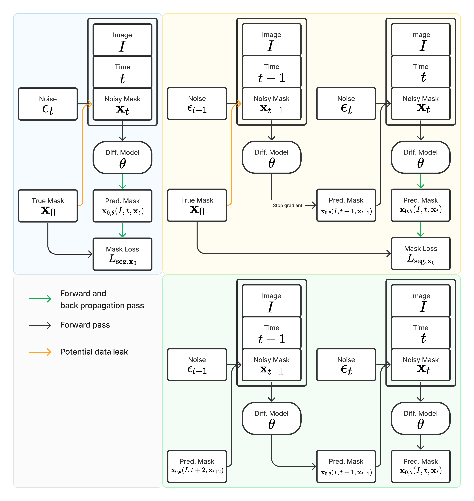

# Importance of Aligning Training Strategy with Evaluation for Diffusion Models in 3D Multiclass Segmentation

:tada: This work has been accepted at
[Deep Generative Models workshop at MICCAI 2023](https://dgm4miccai.github.io/).

:bookmark_tabs: An updated manuscript has also been uploaded at
[arXiv](https://arxiv.org/abs/2303.06040).

:mag_right: We are working on a follow-up work, stay tuned.

<div>
</img>
</div>

<div>
</img>
</div>

## Reproduction

Install the environment and build the dataset following the documentation. Then
run one of the following sets of commands.

```bash
# 3D diffusion for Prostate MR
imgx_train --config-name config_pelvic_diffusion model.name=unet3d_time
imgx_valid --log_dir wandb/latest-run/ --num_timesteps 5
imgx_test --log_dir wandb/latest-run/ --num_timesteps 5

# 2D diffusion for Prostate MR
imgx_train --config-name config_pelvic_diffusion model.name=unet3d_slice_time
imgx_valid --log_dir wandb/latest-run/ --num_timesteps 5
imgx_test --log_dir wandb/latest-run/ --num_timesteps 5

# 3D diffusion for Abdominal CT
imgx_train --config-name config_amos_diffusion model.name=unet3d_time
imgx_valid --log_dir wandb/latest-run/ --num_timesteps 5
imgx_test --log_dir wandb/latest-run/ --num_timesteps 5

# 2D diffusion for Abdominal CT
imgx_train --config-name config_amos_diffusion model.name=unet3d_slice_time
imgx_valid --log_dir wandb/latest-run/ --num_timesteps 5
imgx_test --log_dir wandb/latest-run/ --num_timesteps 5

# 3D Non-diffusion for Prostate MR
imgx_train --config-name config_pelvic_segmentation model.name=unet3d
imgx_valid --log_dir wandb/latest-run/
imgx_test --log_dir wandb/latest-run/

# 2D Non-diffusion for Prostate MR
imgx_train --config-name config_pelvic_segmentation model.name=unet3d_slide
imgx_valid --log_dir wandb/latest-run/
imgx_test --log_dir wandb/latest-run/

# 3D Non-diffusion for Abdominal CT
imgx_train --config-name config_amos_segmentation model.name=unet3d
imgx_valid --log_dir wandb/latest-run/
imgx_test --log_dir wandb/latest-run/

# 2D Non-diffusion for Abdominal CT
imgx_train --config-name config_amos_segmentation model.name=unet3d_slide
imgx_valid --log_dir wandb/latest-run/
imgx_test --log_dir wandb/latest-run/
```

The ablation studies can be performed by adding one of following flags

- Predict noise instead of mask: `task.diffusion.model_out_type=epsilon`
- Do not use Dice loss: `loss.dice=0`
- Do not recycle: `task.diffusion.recycle=False`
- Change training denoising steps: `task.diffusion.num_timesteps=1000`

For instance, to deactivate Dice loss for 3D diffusion on Prostate MR data set:

```bash
imgx_train --config-name config_pelvic_diffusion model.name=unet3d_time loss.dice=0
imgx_valid --log_dir wandb/latest-run/ --num_timesteps 5
imgx_test --log_dir wandb/latest-run/ --num_timesteps 5
```

The configurations are under `imgx/conf/`. If you have 2 GPUs and each GPU
should take one image, please adjust the batch size to 2.

```yaml
batch_size: 2 # number of devices * batch size per device (GPU/TPU)
batch_size_per_replica: 1 # batch size per device (GPU/TPU)
```

## Environment Setup

### TPU with Docker

The following instructions have been tested only for TPU-v3-8. The docker
container uses root user.

1. Build the docker image inside the repository.

   ```bash
   sudo docker build --build-arg USER_ID=$(id -u) --build-arg GROUP_ID=$(id -g) -f docker/Dockerfile.tpu -t imgx .
   ```

   where

   - `--build-arg` provides argument values.
   - `-f` provides the docker file.
   - `-t` tag the docker image.

2. Run the Docker container.

   ```bash
   mkdir -p $(cd ../ && pwd)/tensorflow_datasets
   sudo docker run -it --rm --privileged --network host \
   -v "$(pwd)":/app/ImgX \
   -v "$(cd ../ && pwd)"/tensorflow_datasets:/root/tensorflow_datasets \
   imgx bash
   ```

3. Install the package inside container.

   ```bash
   pip install -e .
   ```

### GPU with Docker

The following instructions have been tested only for CUDA == 11.4.1 and CUDNN ==
8.2.0. The docker container uses non-root user.
[Docker image used may be removed.](https://gitlab.com/nvidia/container-images/cuda/blob/master/doc/support-policy.md)

1. Build the docker image inside the repository.

   ```bash
   docker build --build-arg HOST_UID=$(id -u) --build-arg HOST_GID=$(id -g) -f docker/Dockerfile -t imgx .
   ```

   where

   - `--build-arg` provides argument values.
   - `-f` provides the docker file.
   - `-t` tag the docker image.

2. Run the Docker container.

   ```bash
   mkdir -p $(cd ../ && pwd)/tensorflow_datasets
   docker run -it --rm --gpus all \
   -v "$(pwd)":/app/ImgX \
   -v "$(cd ../ && pwd)"/tensorflow_datasets:/home/app/tensorflow_datasets \
   imgx bash
   ```

   where

   - `--rm` removes the container once exit it.
   - `-v` maps the `ImgX` folder into container.

3. Install the package inside container.

   ```bash
   pip install -e .
   ```

### Local with Conda

#### Install Conda for Mac M1

[Download Miniforge](https://github.com/conda-forge/miniforge/releases/latest/download/Miniforge3-MacOSX-arm64.sh)
from [GitHub](https://github.com/conda-forge/miniforge) and install it.

```bash
conda install -y -n base conda-libmamba-solver
conda config --set solver libmamba
conda env update -f docker/environment_mac_m1.yml
```

#### Install Conda for Linux / Mac Intel

[Install Conda](https://docs.conda.io/projects/conda/en/latest/user-guide/install/index.html)
and then create the environment.

```bash
conda install -y -n base conda-libmamba-solver
conda config --set solver libmamba
conda env update -f docker/environment.yml
```

#### Activate Conda Environment

Activate the environment and install the package.

```bash
conda activate imgx
pip install -e .
```

## Data Processing

### Male Pelvic MR

The data sets will be generated and processed by
[TFDS](https://www.tensorflow.org/datasets/add_dataset). It will be
automatically downloaded from
[Zenodo](https://zenodo.org/record/7013610#.Y1U95-zMKrM) to
`~/tensorflow_datasets` folder.

```bash
tfds build imgx/datasets/male_pelvic_mr
```

Optionally, add flag `--overwrite` to overwrite the generated data set.

```bash
tfds build imgx/datasets/male_pelvic_mr --overwrite
```

### AMOS CT

The data sets will be generated and processed by
[TFDS](https://www.tensorflow.org/datasets/add_dataset). It will be
automatically downloaded from
[Zenodo](https://zenodo.org/record/7155725#.ZAN4BuzP2rO) to
`~/tensorflow_datasets` folder.

```bash
tfds build imgx/datasets/amos_ct
```

Optionally, add flag `--overwrite` to overwrite the generated data set.

```bash
tfds build imgx/datasets/amos_ct --overwrite
```

## Experiment

### Training and Testing

Example command to use two GPUs for training.

```bash
export CUDA_VISIBLE_DEVICES="0,1"
imgx_train --config-name config_pelvic_segmentation
imgx_train --config-name config_pelvic_diffusion
imgx_train --config-name config_amos_segmentation
imgx_train --config-name config_amos_diffusion
```

After training, evaluate the trained models on the test data using the
checkpoint having the best validation performance.

1. For non-diffusion models:

   ```bash
   imgx_valid --log_dir wandb/latest-run/
   imgx_test --log_dir wandb/latest-run/
   ```

2. For diffusion models, set `num_seeds` if using ensemble:

   ```bash
   imgx_valid --log_dir wandb/latest-run/ --num_timesteps 5
   imgx_test --log_dir wandb/latest-run/ --num_timesteps 5 --num_seeds 5
   imgx_test_ensemble --log_dir wandb/latest-run/
   ```

The metrics are stored under `wandb/latest-run/files/test_evaluation/`

## Code Quality

### Pre-commit

Install pre-commit hooks:

```bash
pre-commit install
wily build .
```

Update hooks, and re-verify all files.

```bash
pre-commit autoupdate
pre-commit run --all-files
```

### Code Test

Run the command below to test and get coverage report. As JAX tests requires two
CPUs, `-n 4` uses 4 threads, therefore requires 8 CPUs in total.

```bash
pytest --cov=imgx -n 4 tests
```

## References

- [MONAI (PyTorch)](https://github.com/Project-MONAI/MONAI/)
- [Cross Institution Few Shot Segmentation (PyTorch)](https://github.com/kate-sann5100/CrossInstitutionFewShotSegmentation/)
- [MegSegDiff (PyTorch)](https://github.com/WuJunde/MedSegDiff/)
- [MegSegDiff (PyTorch, lucidrains)](https://github.com/lucidrains/med-seg-diff-pytorch/)
- [DeepReg (Tensorflow)](https://github.com/DeepRegNet/DeepReg/)
- [Scenic (JAX)](https://github.com/google-research/scenic/)
- [DeepMind Research (JAX)](https://github.com/deepmind/deepmind-research/tree/master/ogb_lsc/)
- [Haiku (JAX)](https://github.com/deepmind/dm-haiku/)

## Acknowledgement

This work was supported by the EPSRC grant (EP/T029404/1), the Wellcome/EPSRC
Centre for Interventional and Surgical Sciences (203145Z/16/Z), the
International Alliance for Cancer Early Detection, an alliance between Cancer
Research UK (C28070/A30912, C73666/A31378), Canary Center at Stanford
University, the University of Cambridge, OHSU Knight Cancer Institute,
University College London and the University of Manchester, and Cloud TPUs from
Google’s TPU Research Cloud (TRC).
